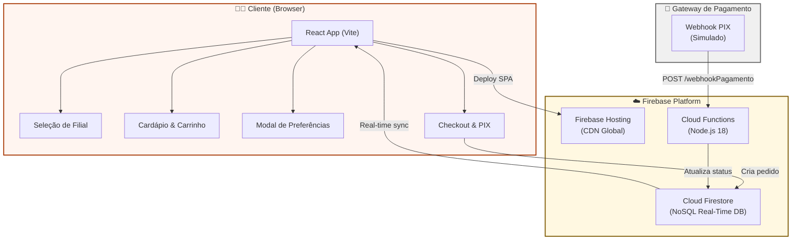
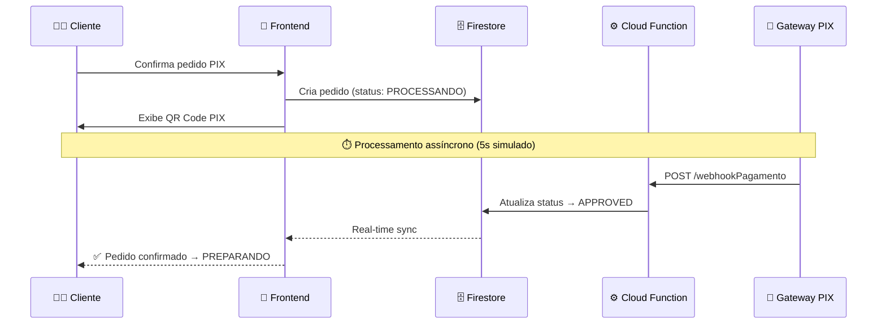
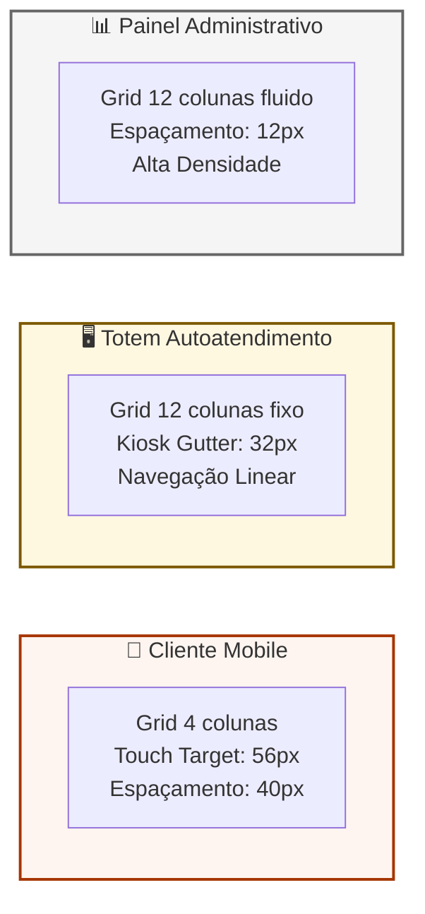
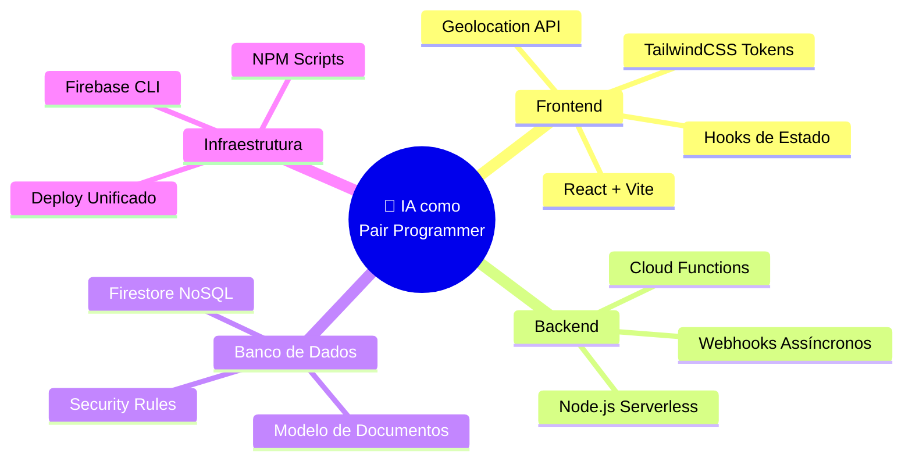

<p align="center">
  
  
  
  
  
  
  
</p>

<h1 align="center">🌵 Raízes do Nordeste</h1>

<p align="center">
  <strong>Sistema de gestão de pedidos para uma rede de culinária nordestina</strong><br/>
  Projeto Multidisciplinar (TCC) · Full-Stack · Serverless · Mobile-First
</p>

<p align="center">
  <a href="#-sobre-o-projeto">Sobre</a> •
  <a href="#-funcionalidades">Funcionalidades</a> •
  <a href="#-arquitetura">Arquitetura</a> •
  <a href="#-stack-tecnológica">Stack</a> •
  <a href="#-estrutura-do-projeto">Estrutura</a> •
  <a href="#-como-executar">Como Executar</a> •
  <a href="#-fluxo-de-operação-e2e">Fluxo E2E</a> •
  <a href="#-design-system">Design System</a> •
  <a href="#-segurança">Segurança</a> •
  <a href="#-conformidade-acadêmica">Conformidade</a> •
  <a href="#-uso-de-ia">Uso de IA</a> •
  <a href="#-licença">Licença</a>
</p>

---

## 📖 Sobre o Projeto

O **Raízes do Nordeste** é um app completo pra gerenciar pedidos de uma rede de lanchonetes de comida nordestina. Foi feito como **TCC do Projeto Multidisciplinar** e tem tudo: app pro cliente pedir pelo celular ou totem, e um painel pro gerente ver os pedidos em tempo real.

O projeto usa **Firebase** como backend (serverless), **pagamento PIX simulado com webhook**, **geolocalização do navegador** pra pegar o endereço do cliente, e um **design system** próprio com as cores da marca.

---

## ✨ Funcionalidades

### 🧑‍💻 Área do Cliente

| Funcionalidade | Descrição |
|---|---|
| 🗺️ **Seleção de Filial** | Mapa interativo com pins das unidades (Recife Centro e Olinda Histórica) |
| 🍽️ **Cardápio Regional** | Itens autênticos nordestinos com fotos reais (Wikimedia Commons) |
| 🛒 **Carrinho de Compras** | Adição e remoção de itens com cálculo dinâmico do total |
| 📋 **Modal de Preferências** | Consumir no local, Retirada ou Entrega — com estimativas de tempo |
| 📍 **Geolocalização** | Captura automática de GPS para endereço de entrega |
| ⏰ **Agendamento** | Opção de agendar horário para retirada ou consumo local |
| 💳 **PIX Interativo** | QR Code vetorial (SVG) estilizado + código Copia e Cola |
| 🔄 **Pagamento Assíncrono** | Webhook simulado processa o pagamento em 5 segundos |

### 🏢 Área do Administrador

| Funcionalidade | Descrição |
|---|---|
| 🔐 **Login Restrito** | Tela de login pra entrar no painel (admin/admin) |
| 📊 **Dashboard de KPIs** | Pedidos Totais, Aguardando Pagamento, Em Preparo |
| 📋 **Fila em Tempo Real** | Pedidos atualizados dinamicamente conforme status do pagamento |
| ✅ **Gestão de Preparo** | Botão para finalizar preparo liberado após aprovação do PIX |

---

## 🏗️ Arquitetura

O projeto é separado em **frontend** (React) e **backend** (Firebase Cloud Functions), com o Firestore como banco de dados. Tudo roda no Firebase, que escala sozinho.

### Diagrama de Arquitetura



### Fluxo de Pagamento Desacoplado



---

## 🛠️ Stack Tecnológica

### Frontend

| Tecnologia | Versão | Finalidade |
|---|---|---|
| **React** | 19.x | Biblioteca de UI componentizada |
| **Vite** | 8.x | Ferramenta de build e servidor local |
| **TailwindCSS** | 3.4 | Framework CSS pra estilizar com classes |
| **Geolocation API** | Web API | Pega a localização GPS do celular |

### Backend

| Tecnologia | Versão | Finalidade |
|---|---|---|
| **Firebase Cloud Functions** | 4.x | Função que processa o pagamento PIX |
| **Firebase Admin SDK** | 11.x | Pra acessar o banco pelo backend |
| **Node.js** | 18 | Runtime do backend |

### Infraestrutura

| Serviço | Finalidade |
|---|---|
| **Firebase Hosting** | Onde o app fica hospedado na internet |
| **Cloud Firestore** | Banco de dados NoSQL (tipo JSON) |
| **Firestore Security Rules** | Regras de quem pode ler/escrever no banco |

---

## 📁 Estrutura do Projeto

```
Raizes_do_Nordeste/
│
├── 📄 README.md                        # Este arquivo
├── 📄 Doc_TCC_Raizes_do_Nordeste.md    # Documentação acadêmica (TCC)
├── 📄 DESIGN.md                        # Design System completo
├── 📄 firebase.json                    # Config unificada Firebase
├── 📄 firestore.rules                  # Regras de segurança Firestore
├── 🖼️ screen.png                       # Screenshot de referência
├── 📄 code.html                        # Protótipo HTML original (Stitch)
│
├── 📂 frontend/                        # Aplicação React (Cliente + Admin)
│   ├── 📄 package.json                 # Dependências NPM (React, Vite, Tailwind)
│   ├── 📄 vite.config.js              # Configuração do Vite
│   ├── 📄 tailwind.config.js           # Design tokens (cores, fontes, espaçamento)
│   ├── 📄 postcss.config.js            # Pipeline CSS (PostCSS + Autoprefixer)
│   ├── 📄 eslint.config.js             # Linting de qualidade de código
│   ├── 📄 index.html                   # Entry point HTML (SPA)
│   │
│   ├── 📂 public/                      # Assets estáticos
│   │
│   ├── 📂 src/                         # Código-fonte principal
│   │   ├── 📄 main.jsx                 # Bootstrap da aplicação React
│   │   ├── 📄 App.jsx                  # Roteador de telas e estado global
│   │   ├── 📄 App.css                  # Estilos globais customizados
│   │   ├── 📄 index.css                # Reset CSS e imports Tailwind
│   │   │
│   │   ├── 📂 components/              # Componentes React
│   │   │   ├── 📄 UnitSelection.jsx    # Tela de seleção de unidade (mapa)
│   │   │   ├── 📄 CustomerMenu.jsx     # Cardápio + Carrinho + Modal Preferências
│   │   │   ├── 📄 CustomerCheckout.jsx # Checkout + QR Code PIX
│   │   │   ├── 📄 AdminLogin.jsx       # Tela de login do administrador
│   │   │   └── 📄 AdminDashboard.jsx   # Painel de gestão e fila de pedidos
│   │   │
│   │   ├── 📂 data/                    # Dados mockados
│   │   │   └── 📄 mockData.js          # Itens do cardápio (pratos e preços)
│   │   │
│   │   └── 📂 assets/                  # Imagens e recursos visuais
│   │
│   └── 📂 dist/                        # Build de produção (gerado)
│
└── 📂 functions/                       # Firebase Cloud Functions (Backend)
    ├── 📄 package.json                 # Dependências do backend
    └── 📄 index.js                     # Webhook de pagamento desacoplado
```

---

## 🚀 Como Executar

### Pré-requisitos

- **Node.js** v16 ou superior ([download](https://nodejs.org/))
- **npm** (incluído com o Node.js)
- **Git** (opcional, para clonar o repositório)

### Instalação

```bash
# 1. Clone o repositório
git clone https://github.com/SEU_USUARIO/Raizes_do_Nordeste.git

# 2. Acesse a pasta do frontend
cd Raizes_do_Nordeste/frontend

# 3. Instale as dependências
npm install
```

### Execução em Desenvolvimento

```bash
# Inicie o servidor de desenvolvimento
npm run dev

# A aplicação estará disponível em:
# → http://localhost:5173/
```

### Build de Produção

```bash
# Compile para produção
npm run build

# Preview do build
npm run preview
```

### Credenciais de Acesso (Admin)

| Campo | Valor |
|---|---|
| **Usuário** | `admin` |
| **Senha** | `admin` |

> ⚠️ **Nota:** Essas credenciais são só pra demonstração. Num sistema real usaria Firebase Auth ou OAuth.

---

## 🔄 Fluxo de Operação E2E

```mermaid
flowchart LR
    A["🗺️ Seleciona Filial"] --> B["🍽️ Navega Cardápio"]
    B --> C["🛒 Monta Carrinho"]
    C --> D["📋 Escolhe Modalidade"]
    D --> E{"Tipo?"}
    E -->|"🏠 Local / 🏃 Retirada"| F["Nome + Agendamento"]
    E -->|"🚚 Entrega"| G["Nome + GPS + Contato"]
    F --> H["💳 Checkout PIX"]
    G --> H
    H --> I["📱 QR Code + Copia&Cola"]
    I --> J["⏱️ Webhook 5s"]
    J --> K["✅ APPROVED"]
    K --> L["👨‍🍳 Cozinha: PREPARANDO"]
    L --> M["🎉 Pedido Finalizado"]

    style A fill:#FFF5F0,stroke:#a63500
    style K fill:#E8F5E9,stroke:#2E7D32
    style M fill:#E8F5E9,stroke:#2E7D32
```



### Detalhes por Modalidade

| Modalidade | Tempo Estimado | Dados Coletados |
|---|---|---|
| 🏠 **Consumir no Local** | ~15-20 min | Nome + Horário (opcional) |
| 🏃 **Retirada** | ~20-25 min | Nome + Horário (opcional) |
| 🚚 **Entrega** | ~40-50 min | Nome + Telefone + GPS (Geolocalização) |

---

## 🎨 Design System

O design system é documentado integralmente no arquivo [`DESIGN.md`](DESIGN.md) e implementado via tokens no [`tailwind.config.js`](frontend/tailwind.config.js).

### Paleta de Cores

| Token | Cor | Hex | Uso |
|---|---|---|---|
| `primary` | 🟠 Terracotta | `#a63500` | Ações primárias, botões, marca |
| `secondary` | 🟡 Bronze/Amarelo | `#7c5800` | Highlights, métricas secundárias |
| `background` | ⬜ Bone | `#fcf9f8` | Fundo principal (low-glare) |
| `surface` | ⬜ Branco Quente | `#f6f3f2` | Cards e containers |
| `on-surface` | ⬛ Quase Preto | `#1c1b1b` | Texto principal |
| `error` | 🔴 Vermelho | `#ba1a1a` | Estados de erro |

### Tipografia (3 fontes)

| Fonte | Uso | Peso |
|---|---|---|
| **Bricolage Grotesque** | Headlines, títulos de seções | 700-800 |
| **Be Vietnam Pro** | Corpo de texto, navegação | 400 |
| **JetBrains Mono** | IDs de pedidos, timestamps | 500 |

### Princípios de Layout



---

## 🔒 Segurança

### Firestore Security Rules

```javascript
// regras de quem pode acessar o que
match /unidades/{unidadeId} {
  allow read: if true;         // ✅ cardapio é publico, qualquer um ve
}

match /produtos/{produtoId} {
  allow read: if true;         // ✅ produtos tbm sao publicos
}

match /{document=**} {
  allow read, write: if request.auth != null;  // 🔐 o resto so quem ta logado
}
```

### Dados Sensíveis

> ✅ **Este repositório NÃO contém dados sensíveis.**

| Item | Status | Observação |
|---|---|---|
| API Keys / Secrets | ❌ Não presente | Nenhuma chave de API hardcoded |
| Dados de clientes reais | ❌ Não presente | Todos os dados são mockados |
| Credenciais de produção | ❌ Não presente | `admin/admin` é apenas para demo |
| Variáveis de ambiente | ❌ Não presente | Nenhum `.env` no repositório |
| Firebase Config | ❌ Não presente | Configuração local, não commitada |

---

## 📋 Conformidade Acadêmica

O projeto segue as diretrizes do **Roteiro Prático do Projeto Multidisciplinar**:

| Seção | Diretriz | Implementação |
|---|---|---|
| **Seção 2** | Multicanalidade | Interface responsiva para App Mobile e Totem (touch targets de 48px+) |
| **Seção 3** | Segurança e Acesso | Firestore Rules + Login administrativo (`admin/admin`) |
| **Seção 4** | Fidelização e LGPD | Campos de consentimento explícito para armazenamento de dados |
| **Seção 5** | Desacoplamento de Pagamento | Webhook assíncrono (Cloud Function) media checkout → cozinha |
| **Seção 8** | Declaração de Uso de IA | Documentação completa no [Doc_TCC](Doc_TCC_Raizes_do_Nordeste.md) |

---

## 🤖 Uso de IA

Usei **IA** (Antigravity e Stitch) durante o desenvolvimento como um **pair programmer** — tipo um colega que vai ajudando e explicando. Não foi só copiar e colar. A documentação completa tá no [`Doc_TCC_Raizes_do_Nordeste.md`](Doc_TCC_Raizes_do_Nordeste.md).

### Trilhas de Aprendizado com IA



> **Resumindo:** a IA ajudou demais a sair da teoria pra prática. Sem ela ia demorar bem mais, mas eu precisei entender cada parte pra conseguir pedir as coisas certas e fazer funcionar.

---

## 📚 Documentação Completa

| Documento | Descrição |
|---|---|
| [`README.md`](README.md) | Este arquivo — visão geral do projeto |
| [`Doc_TCC_Raizes_do_Nordeste.md`](Doc_TCC_Raizes_do_Nordeste.md) | Documentação acadêmica completa (Requisitos, DER, Anexos de IA) |
| [`DESIGN.md`](DESIGN.md) | Design System (cores, tipografia, layout, componentes) |
| [`firestore.rules`](firestore.rules) | Regras de segurança do banco de dados |
| [`firebase.json`](firebase.json) | Configuração unificada de deploy |

---

## 📄 Licença

Este projeto é de uso acadêmico, desenvolvido para o **Projeto Multidisciplinar (TCC)**. Distribuído sob a licença MIT.

---

<p align="center">
  Feito com 🧡 e ☀️ no Nordeste do Brasil
</p>
